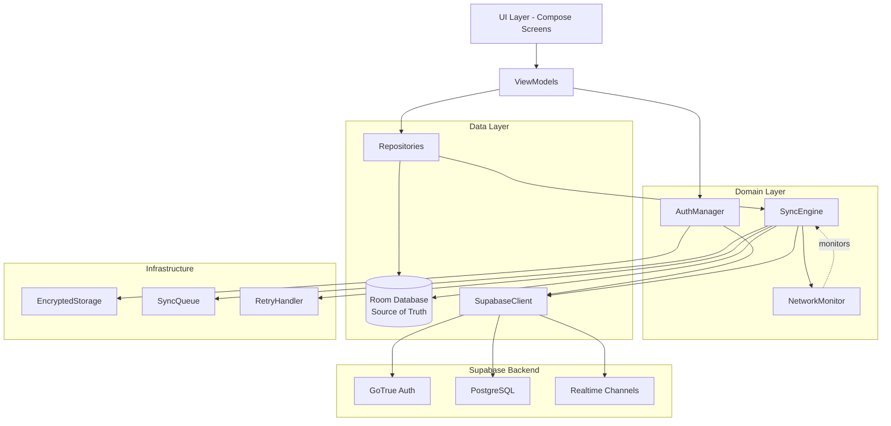
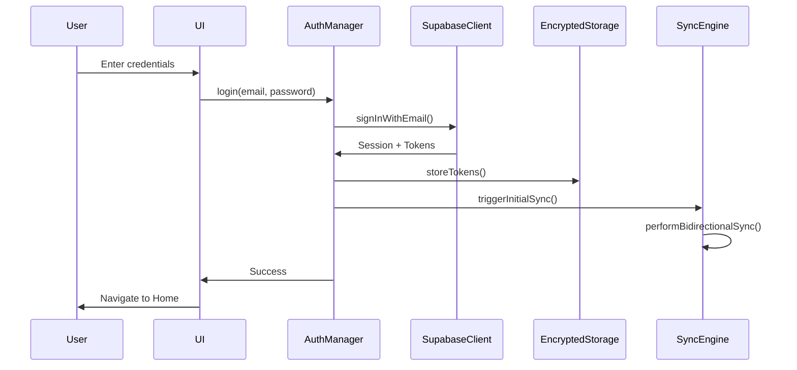
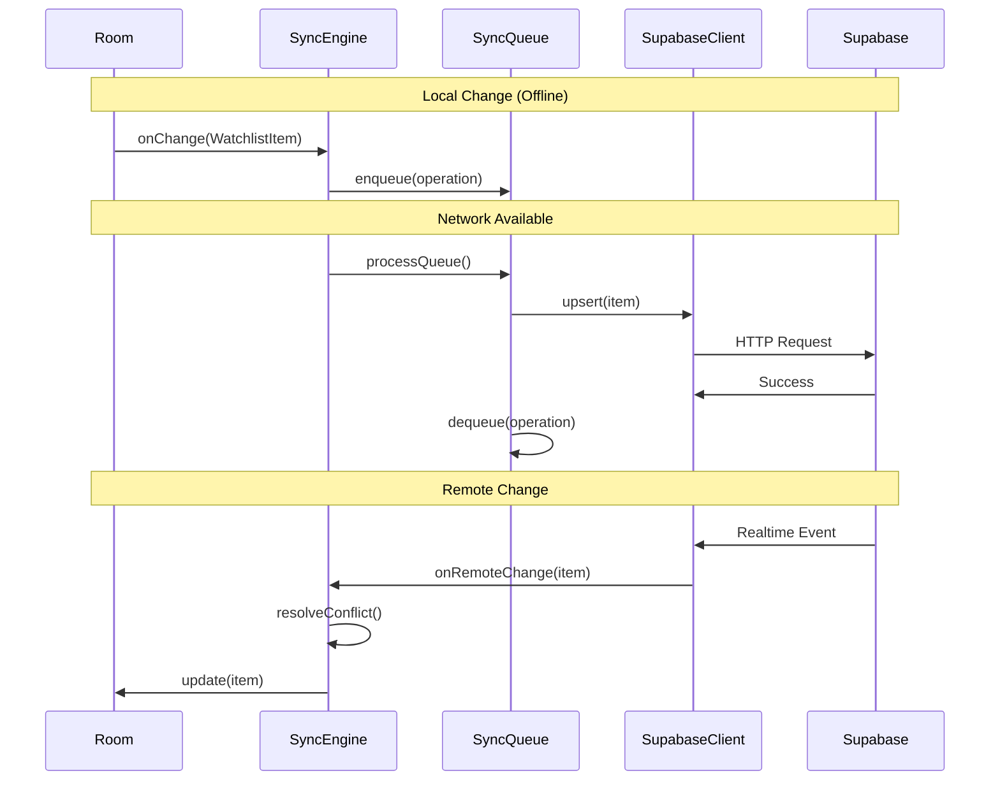

# Design Document: Supabase Integration

## Overview

This design implements Supabase backend integration for the StocKamp Android application, enabling user authentication, cloud synchronization, and real-time data updates while maintaining an offline-first architecture. The integration uses the Supabase Kotlin SDK with Room Database as the source of truth, ensuring the app remains fully functional offline with automatic synchronization when connectivity is restored.

The architecture follows a layered approach:
- **Presentation Layer**: Existing UI components (LoginScreen, RegisterScreen, etc.)
- **Domain Layer**: New Auth and Sync managers coordinating business logic
- **Data Layer**: Room Database (source of truth) + Supabase Client (cloud backend)
- **Infrastructure Layer**: Network monitoring, encrypted storage, retry mechanisms

Key design principles:
- Offline-first: All operations work locally first, sync happens asynchronously
- Eventual consistency: Last-write-wins conflict resolution with timestamps
- Security: Encrypted token storage, secure API key management
- Resilience: Exponential backoff retry logic, queue-based sync operations

## Architecture

### Component Diagram



### Authentication Flow



### Sync Flow



## Components and Interfaces

### 1. AuthManager

Manages user authentication, session persistence, and profile operations.

```kotlin
interface AuthManager {
    // Authentication
    suspend fun register(email: String, password: String): Result<UserProfile>
    suspend fun login(email: String, password: String): Result<UserProfile>
    suspend fun logout(): Result<Unit>
    
    // Session Management
    suspend fun restoreSession(): Result<UserProfile?>
    suspend fun refreshToken(): Result<Unit>
    fun getCurrentUser(): Flow<UserProfile?>
    fun isAuthenticated(): Flow<Boolean>
    
    // Profile Management
    suspend fun getProfile(): Result<UserProfile>
    suspend fun updateProfile(displayName: String): Result<UserProfile>
    suspend fun deleteAccount(): Result<Unit>
}

class AuthManagerImpl(
    private val supabaseClient: SupabaseClient,
    private val encryptedStorage: EncryptedStorage,
    private val syncEngine: SyncEngine
) : AuthManager {
    // Implementation details
}
```

### 2. SyncEngine

Coordinates bidirectional synchronization between Room and Supabase.

```kotlin
interface SyncEngine {
    // Sync Operations
    suspend fun syncWatchlist(): Result<Unit>
    suspend fun syncJournal(): Result<Unit>
    suspend fun performFullSync(): Result<Unit>
    suspend fun performInitialMigration(): Result<Unit>
    
    // Real-time Subscriptions
    suspend fun subscribeToRealtimeUpdates()
    suspend fun unsubscribeFromRealtimeUpdates()
    
    // Sync Status
    fun getSyncStatus(): Flow<SyncStatus>
    fun getPendingOperationsCount(): Flow<Int>
    fun getLastSyncTimestamp(): Flow<Long?>
    
    // Manual Triggers
    suspend fun enqueueSyncOperation(operation: SyncOperation)
    suspend fun processSyncQueue()
}

data class SyncStatus(
    val state: SyncState,
    val pendingCount: Int,
    val lastSync: Long?,
    val error: String?
)

enum class SyncState {
    IDLE, SYNCING, ERROR, OFFLINE
}

sealed class SyncOperation {
    data class UpsertWatchlist(val item: WatchlistItem) : SyncOperation()
    data class DeleteWatchlist(val id: Long) : SyncOperation()
    data class UpsertJournal(val entry: JournalEntry) : SyncOperation()
    data class DeleteJournal(val id: Long) : SyncOperation()
}
```

### 3. SupabaseClient

Wrapper around Supabase SDK providing typed API access.

```kotlin
interface SupabaseClient {
    // Auth
    suspend fun signUp(email: String, password: String): Result<Session>
    suspend fun signIn(email: String, password: String): Result<Session>
    suspend fun signOut(): Result<Unit>
    suspend fun refreshSession(): Result<Session>
    fun getCurrentSession(): Session?
    
    // Watchlist
    suspend fun fetchWatchlist(userId: String): Result<List<WatchlistItem>>
    suspend fun upsertWatchlistItem(item: WatchlistItem): Result<WatchlistItem>
    suspend fun deleteWatchlistItem(id: Long): Result<Unit>
    
    // Journal
    suspend fun fetchJournalEntries(userId: String): Result<List<JournalEntry>>
    suspend fun upsertJournalEntry(entry: JournalEntry): Result<JournalEntry>
    suspend fun deleteJournalEntry(id: Long): Result<Unit>
    
    // Profile
    suspend fun fetchUserProfile(userId: String): Result<UserProfile>
    suspend fun updateUserProfile(userId: String, displayName: String): Result<UserProfile>
    suspend fun deleteUserData(userId: String): Result<Unit>
    
    // Realtime
    fun subscribeToWatchlistChanges(userId: String, onEvent: (WatchlistItem, ChangeType) -> Unit)
    fun subscribeToJournalChanges(userId: String, onEvent: (JournalEntry, ChangeType) -> Unit)
    fun unsubscribeAll()
}

enum class ChangeType {
    INSERT, UPDATE, DELETE
}
```

### 4. NetworkMonitor

Monitors network connectivity to trigger sync operations.

```kotlin
interface NetworkMonitor {
    fun isOnline(): Flow<Boolean>
    fun observeConnectivity(): Flow<ConnectivityStatus>
}

enum class ConnectivityStatus {
    AVAILABLE, UNAVAILABLE, LOSING, LOST
}

class NetworkMonitorImpl(
    private val context: Context
) : NetworkMonitor {
    // Uses ConnectivityManager.NetworkCallback
}
```

### 5. EncryptedStorage

Securely stores authentication tokens and sensitive data.

```kotlin
interface EncryptedStorage {
    suspend fun storeAccessToken(token: String)
    suspend fun getAccessToken(): String?
    suspend fun storeRefreshToken(token: String)
    suspend fun getRefreshToken(): String?
    suspend fun clearTokens()
    suspend fun storeMigrationComplete(complete: Boolean)
    suspend fun isMigrationComplete(): Boolean
}

class EncryptedStorageImpl(
    private val context: Context
) : EncryptedStorage {
    // Uses EncryptedSharedPreferences
}
```

### 6. SyncQueue

Persistent queue for sync operations with retry logic.

```kotlin
interface SyncQueue {
    suspend fun enqueue(operation: SyncOperation)
    suspend fun dequeue(): SyncOperation?
    suspend fun peek(): SyncOperation?
    suspend fun remove(operation: SyncOperation)
    suspend fun clear()
    suspend fun getAll(): List<SyncOperation>
    suspend fun size(): Int
}

class SyncQueueImpl(
    private val database: StocKampDatabase
) : SyncQueue {
    // Stores operations in Room table
}
```

## Data Models

### Database Schema Updates

Add sync-related fields to existing entities:

```kotlin
@Entity(tableName = "watchlist")
data class WatchlistItem(
    @PrimaryKey(autoGenerate = true)
    val id: Long = 0,
    val userId: String = "",
    val symbol: String,
    val name: String,
    val addedAt: Long = System.currentTimeMillis(),
    
    // New sync fields
    val createdAt: Long = System.currentTimeMillis(),
    val modifiedAt: Long = System.currentTimeMillis(),
    val syncedAt: Long? = null,
    val isDeleted: Boolean = false
)

@Entity(tableName = "journal_entries")
data class JournalEntry(
    @PrimaryKey(autoGenerate = true)
    val id: Long = 0,
    val userId: String = "",
    val symbol: String,
    val action: String,
    val quantity: Int,
    val price: Double,
    val totalValue: Double = quantity * price,
    val notes: String = "",
    val emotion: String = "",
    val strategy: String = "",
    val createdAt: Long = System.currentTimeMillis(),
    
    // New sync fields
    val modifiedAt: Long = System.currentTimeMillis(),
    val syncedAt: Long? = null,
    val isDeleted: Boolean = false
)
```

### New Entities

```kotlin
@Entity(tableName = "sync_queue")
data class SyncQueueItem(
    @PrimaryKey(autoGenerate = true)
    val id: Long = 0,
    val operationType: String, // "UPSERT_WATCHLIST", "DELETE_WATCHLIST", etc.
    val entityId: Long,
    val entityData: String, // JSON serialized entity
    val createdAt: Long = System.currentTimeMillis(),
    val retryCount: Int = 0,
    val lastAttempt: Long? = null
)

@Entity(tableName = "sync_metadata")
data class SyncMetadata(
    @PrimaryKey
    val key: String,
    val value: String,
    val updatedAt: Long = System.currentTimeMillis()
)
```

### Supabase Tables

Tables to create in Supabase PostgreSQL:

```sql
-- User profiles (extends auth.users)
CREATE TABLE user_profiles (
    id UUID PRIMARY KEY REFERENCES auth.users(id) ON DELETE CASCADE,
    email TEXT NOT NULL,
    display_name TEXT,
    created_at TIMESTAMPTZ DEFAULT NOW(),
    updated_at TIMESTAMPTZ DEFAULT NOW()
);

-- Watchlist items
CREATE TABLE watchlist_items (
    id BIGSERIAL PRIMARY KEY,
    user_id UUID NOT NULL REFERENCES auth.users(id) ON DELETE CASCADE,
    symbol TEXT NOT NULL,
    name TEXT NOT NULL,
    added_at TIMESTAMPTZ NOT NULL,
    created_at TIMESTAMPTZ DEFAULT NOW(),
    modified_at TIMESTAMPTZ DEFAULT NOW(),
    is_deleted BOOLEAN DEFAULT FALSE
);

-- Journal entries
CREATE TABLE journal_entries (
    id BIGSERIAL PRIMARY KEY,
    user_id UUID NOT NULL REFERENCES auth.users(id) ON DELETE CASCADE,
    symbol TEXT NOT NULL,
    action TEXT NOT NULL,
    quantity INTEGER NOT NULL,
    price NUMERIC(10, 2) NOT NULL,
    total_value NUMERIC(12, 2) NOT NULL,
    notes TEXT,
    emotion TEXT,
    strategy TEXT,
    created_at TIMESTAMPTZ NOT NULL,
    modified_at TIMESTAMPTZ DEFAULT NOW(),
    is_deleted BOOLEAN DEFAULT FALSE
);

-- Indexes
CREATE INDEX idx_watchlist_user_id ON watchlist_items(user_id);
CREATE INDEX idx_watchlist_modified ON watchlist_items(modified_at);
CREATE INDEX idx_journal_user_id ON journal_entries(user_id);
CREATE INDEX idx_journal_modified ON journal_entries(modified_at);

-- Row Level Security
ALTER TABLE user_profiles ENABLE ROW LEVEL SECURITY;
ALTER TABLE watchlist_items ENABLE ROW LEVEL SECURITY;
ALTER TABLE journal_entries ENABLE ROW LEVEL SECURITY;

-- Policies
CREATE POLICY "Users can view own profile" ON user_profiles
    FOR SELECT USING (auth.uid() = id);
    
CREATE POLICY "Users can update own profile" ON user_profiles
    FOR UPDATE USING (auth.uid() = id);

CREATE POLICY "Users can view own watchlist" ON watchlist_items
    FOR SELECT USING (auth.uid() = user_id);
    
CREATE POLICY "Users can insert own watchlist" ON watchlist_items
    FOR INSERT WITH CHECK (auth.uid() = user_id);
    
CREATE POLICY "Users can update own watchlist" ON watchlist_items
    FOR UPDATE USING (auth.uid() = user_id);
    
CREATE POLICY "Users can delete own watchlist" ON watchlist_items
    FOR DELETE USING (auth.uid() = user_id);

CREATE POLICY "Users can view own journal" ON journal_entries
    FOR SELECT USING (auth.uid() = user_id);
    
CREATE POLICY "Users can insert own journal" ON journal_entries
    FOR INSERT WITH CHECK (auth.uid() = user_id);
    
CREATE POLICY "Users can update own journal" ON journal_entries
    FOR UPDATE USING (auth.uid() = user_id);
    
CREATE POLICY "Users can delete own journal" ON journal_entries
    FOR DELETE USING (auth.uid() = user_id);
```


## Correctness Properties

*A property is a characteristic or behavior that should hold true across all valid executions of a system—essentially, a formal statement about what the system should do. Properties serve as the bridge between human-readable specifications and machine-verifiable correctness guarantees.*

Before defining the correctness properties, I need to analyze each acceptance criterion for testability.


### Property 1: Successful Registration Creates Account and Stores Token

*For any* valid email and password combination, when registration succeeds, the system should create a Supabase account, store an auth token in encrypted storage, and create a user profile record that can be retrieved.

**Validates: Requirements 1.1, 1.2, 1.3**

### Property 2: Duplicate Email Registration Fails

*For any* email address, if an account already exists with that email, attempting to register again should fail with a duplicate account error.

**Validates: Requirements 1.4**

### Property 3: Short Password Registration Fails

*For any* password with length less than 8 characters, registration should fail with an insufficient password strength error.

**Validates: Requirements 1.5**

### Property 4: Successful Login Authenticates and Triggers Sync

*For any* valid credentials, login should succeed, store an auth token in encrypted storage, and trigger the sync engine to synchronize data.

**Validates: Requirements 2.1, 2.2, 2.3**

### Property 5: Invalid Credentials Login Fails

*For any* invalid credential combination (wrong email or wrong password), login should fail with an authentication failure error.

**Validates: Requirements 2.4**

### Property 6: Valid Token Restores Session

*For any* valid auth token stored in encrypted storage, when the app starts, the session should be automatically restored without requiring re-authentication.

**Validates: Requirements 3.1, 3.2**

### Property 7: Logout Clears Session Data

*For any* authenticated session, when logout is performed, the auth token should be revoked and all local session data should be cleared from encrypted storage.

**Validates: Requirements 3.5**

### Property 8: Profile Retrieval Returns User Data

*For any* authenticated user, requesting profile data should successfully retrieve a UserProfile containing email, display name, and account creation timestamp.

**Validates: Requirements 4.1, 4.5**

### Property 9: Profile Update Persists Changes

*For any* authenticated user and any valid profile update, the changes should be persisted to Supabase and the local cached profile should reflect the updated values.

**Validates: Requirements 4.2, 4.3**

### Property 10: Remote Changes Update Local Database

*For any* remote change (insert, update, or delete) to watchlist items or journal entries, the sync engine should update the Room database to reflect the remote state.

**Validates: Requirements 5.5, 6.5**

### Property 11: Offline Changes Are Queued

*For any* local change (create, update, or delete) made while offline, the sync engine should queue the operation and process it when connectivity resumes.

**Validates: Requirements 5.6, 6.6, 10.3**

### Property 12: Last-Write-Wins Conflict Resolution

*For any* sync conflict where the same record is modified both locally and remotely, the sync engine should preserve the version with the most recent modification timestamp.

**Validates: Requirements 7.1, 7.2, 7.3**

### Property 13: Conflict Resolutions Are Logged

*For any* sync conflict that is resolved, the sync engine should create a log entry containing the conflict details and resolution outcome.

**Validates: Requirements 7.4**

### Property 14: Realtime Subscriptions Active When Online

*For any* authenticated session when the app is online, the sync engine should maintain active realtime subscriptions for both watchlist and journal changes.

**Validates: Requirements 8.1, 8.2**

### Property 15: Offline Transition Unsubscribes Realtime

*For any* active realtime subscription, when the app goes offline, the sync engine should unsubscribe from all realtime channels.

**Validates: Requirements 8.5**

### Property 16: Online Transition Resubscribes Realtime

*For any* authenticated session, when the app transitions from offline to online, the sync engine should resubscribe to realtime channels for watchlist and journal changes.

**Validates: Requirements 8.6**

### Property 17: Offline Database Access Remains Functional

*For any* database operation (read or write) on watchlist items or journal entries, the operation should succeed when offline using the Room database.

**Validates: Requirements 10.2**

### Property 18: Sync Status Reflects Current State

*For any* sync state (online, offline, syncing, error), the app should display a corresponding status indicator visible to the user.

**Validates: Requirements 10.5, 15.1**

### Property 19: Migration Completes Only Once

*For any* user account, after the initial migration of local data to Supabase completes successfully, the migration flag should be set to prevent duplicate uploads on subsequent logins.

**Validates: Requirements 11.3**

### Property 20: Failed Migration Records Retry

*For any* record that fails to upload during initial migration, the sync engine should retry uploading that record on the next sync attempt.

**Validates: Requirements 11.4**

### Property 21: Creation Timestamps Are Recorded

*For any* newly created watchlist item or journal entry, the Room database should record a creation timestamp in UTC format.

**Validates: Requirements 12.1, 12.3**

### Property 22: Modification Timestamps Are Updated

*For any* modification to a watchlist item or journal entry, the Room database should update the modification timestamp to the current UTC time.

**Validates: Requirements 12.2, 12.4**

### Property 23: Sync Preserves Creation Timestamps

*For any* record synchronized between Room and Supabase, the original creation timestamp should remain unchanged after a complete sync round-trip.

**Validates: Requirements 12.6**

### Property 24: Network Failures Trigger Exponential Backoff Retry

*For any* sync operation that fails due to network error, the sync engine should retry the operation up to 3 times with exponential backoff delays between attempts.

**Validates: Requirements 13.1**

### Property 25: Exhausted Retries Queue Operation

*For any* sync operation that fails all retry attempts, the sync engine should add the operation to the sync queue for processing in the next sync cycle.

**Validates: Requirements 13.3**

### Property 26: Server Errors Are Logged With Context

*For any* sync operation that fails due to server error, the sync engine should create a log entry containing the full error context including operation details and error response.

**Validates: Requirements 13.4**

### Property 27: Account Deletion Removes All User Data

*For any* user account deletion request, the auth manager should delete the user profile, and the sync engine should delete all associated watchlist items and journal entries from Supabase.

**Validates: Requirements 14.1, 14.2, 14.3**

### Property 28: Account Deletion Clears Local Data

*For any* completed account deletion, the auth manager should clear all local data including Room database records and revoke all auth tokens.

**Validates: Requirements 14.4, 14.5**

### Property 29: Failed Deletion Preserves Data

*For any* account deletion request that fails, the auth manager should return an error and preserve all local data in the Room database unchanged.

**Validates: Requirements 14.6**

### Property 30: Sync Progress Shows Pending Count

*For any* sync operation in progress, the app should display the number of pending changes waiting to be synchronized.

**Validates: Requirements 15.2**

### Property 31: Successful Sync Updates Timestamp

*For any* successfully completed sync operation, the app should display the timestamp of when the sync completed.

**Validates: Requirements 15.3**

### Property 32: Sync Errors Display Indicator

*For any* sync error that occurs, the app should display an error indicator with an option to view detailed error information.

**Validates: Requirements 15.4**

## Error Handling

### Authentication Errors

**Invalid Credentials**
- Detect: Check Supabase auth response for invalid_grant or invalid_credentials error codes
- Handle: Return user-friendly error message "Invalid email or password"
- Recover: Allow user to retry with correct credentials

**Expired Token**
- Detect: Check for token_expired or session_expired error codes
- Handle: Automatically attempt token refresh using refresh token
- Recover: If refresh succeeds, retry original operation; if refresh fails, require re-authentication

**Network Unavailable**
- Detect: Catch network exceptions (UnknownHostException, SocketTimeoutException)
- Handle: Return error message "Unable to connect. Please check your internet connection"
- Recover: Queue operation for retry when network becomes available

**Duplicate Account**
- Detect: Check for user_already_exists or email_exists error code
- Handle: Return error message "An account with this email already exists"
- Recover: Prompt user to login instead or use different email

**Weak Password**
- Detect: Validate password length client-side before API call
- Handle: Return error message "Password must be at least 8 characters"
- Recover: Prompt user to enter stronger password

### Sync Errors

**Conflict Detection**
- Detect: Compare modification timestamps between local and remote records
- Handle: Apply last-write-wins strategy, keeping record with latest timestamp
- Recover: Update losing side with winning record, log conflict resolution

**Partial Sync Failure**
- Detect: Track success/failure status for each operation in batch
- Handle: Mark failed operations in sync queue with retry count
- Recover: Retry failed operations with exponential backoff (1s, 2s, 4s)

**Server Error (5xx)**
- Detect: Check HTTP response status codes 500-599
- Handle: Log full error context, display generic error to user
- Recover: Retry with exponential backoff up to 3 attempts, then queue for next sync cycle

**Rate Limiting (429)**
- Detect: Check for HTTP 429 status code
- Handle: Extract retry-after header value
- Recover: Wait for specified duration before retrying operation

**Data Validation Error**
- Detect: Check for validation error responses from Supabase
- Handle: Log validation details, mark operation as failed
- Recover: Do not retry (invalid data), notify user to correct data

### Database Errors

**Migration Failure**
- Detect: Catch Room migration exceptions during database version upgrade
- Handle: Log migration error with schema details
- Recover: Fallback to destructive migration (data loss) or prompt user to reinstall

**Disk Full**
- Detect: Catch SQLiteFullException
- Handle: Display error "Storage space is full"
- Recover: Prevent new writes, prompt user to free up space

**Corruption**
- Detect: Catch SQLiteDatabaseCorruptException
- Handle: Log corruption details, attempt database repair
- Recover: If repair fails, delete and recreate database (data loss)

### Realtime Errors

**Subscription Failure**
- Detect: Check realtime channel subscription error callbacks
- Handle: Log subscription error details
- Recover: Retry subscription with exponential backoff, fallback to polling if persistent failure

**Connection Drop**
- Detect: Monitor realtime connection status callbacks
- Handle: Unsubscribe from channels, mark as offline
- Recover: Attempt reconnection when network available, perform full sync on reconnect

## Testing Strategy

### Unit Testing

The testing strategy employs both traditional unit tests and property-based tests for comprehensive coverage.

**Unit Test Focus Areas:**
- Specific error scenarios (expired token, network failure, duplicate account)
- Edge cases (empty data sets, null values, boundary conditions)
- Integration points between components (AuthManager → SyncEngine, SyncEngine → Room)
- State transitions (offline → online, unauthenticated → authenticated)

**Example Unit Tests:**
- Test login with invalid credentials returns authentication error
- Test logout clears encrypted storage
- Test sync queue processes operations in FIFO order
- Test conflict resolution chooses record with later timestamp
- Test realtime subscription cleanup on logout

### Property-Based Testing

Property-based testing validates universal properties across many generated inputs using a PBT library.

**PBT Library:** Kotest Property Testing (for Kotlin/Android)

**Configuration:**
- Minimum 100 iterations per property test
- Each test tagged with: `Feature: supabase-integration, Property {number}: {property_text}`

**Property Test Implementation Examples:**

```kotlin
// Property 1: Successful Registration Creates Account and Stores Token
@Test
fun `property 1 - successful registration creates account and stores token`() = runTest {
    // Feature: supabase-integration, Property 1: Successful Registration Creates Account and Stores Token
    checkAll(100, Arb.email(), Arb.string(8..20)) { email, password ->
        // Arrange: Clean state
        authManager.logout()
        
        // Act: Register
        val result = authManager.register(email, password)
        
        // Assert: Account created, token stored, profile exists
        result.isSuccess shouldBe true
        encryptedStorage.getAccessToken() shouldNotBe null
        val profile = authManager.getProfile()
        profile.isSuccess shouldBe true
        profile.getOrNull()?.email shouldBe email
    }
}

// Property 11: Offline Changes Are Queued
@Test
fun `property 11 - offline changes are queued`() = runTest {
    // Feature: supabase-integration, Property 11: Offline Changes Are Queued
    checkAll(100, Arb.watchlistItem(), Arb.journalEntry()) { watchlistItem, journalEntry ->
        // Arrange: Set offline state
        networkMonitor.setOffline()
        
        // Act: Make local changes
        watchlistDao.insertWatchlistItem(watchlistItem)
        journalDao.insertEntry(journalEntry)
        
        // Assert: Operations queued
        val queueSize = syncQueue.size()
        queueSize shouldBeGreaterThan 0
        
        // Verify operations processed when online
        networkMonitor.setOnline()
        syncEngine.processSyncQueue()
        
        // Eventually queue should be empty
        eventually(5.seconds) {
            syncQueue.size() shouldBe 0
        }
    }
}

// Property 12: Last-Write-Wins Conflict Resolution
@Test
fun `property 12 - last-write-wins conflict resolution`() = runTest {
    // Feature: supabase-integration, Property 12: Last-Write-Wins Conflict Resolution
    checkAll(100, Arb.watchlistItem()) { baseItem ->
        // Arrange: Create conflict scenario
        val localItem = baseItem.copy(modifiedAt = System.currentTimeMillis())
        val remoteItem = baseItem.copy(
            name = "Remote Name",
            modifiedAt = localItem.modifiedAt + 1000 // Remote is newer
        )
        
        // Act: Trigger conflict resolution
        watchlistDao.insertWatchlistItem(localItem)
        syncEngine.handleRemoteChange(remoteItem)
        
        // Assert: Remote (newer) version wins
        val resolved = watchlistDao.getWatchlistItem(baseItem.symbol)
        resolved?.name shouldBe "Remote Name"
        resolved?.modifiedAt shouldBe remoteItem.modifiedAt
    }
}

// Property 23: Sync Preserves Creation Timestamps
@Test
fun `property 23 - sync preserves creation timestamps`() = runTest {
    // Feature: supabase-integration, Property 23: Sync Preserves Creation Timestamps
    checkAll(100, Arb.journalEntry()) { entry ->
        // Arrange: Insert locally
        val originalCreatedAt = entry.createdAt
        journalDao.insertEntry(entry)
        
        // Act: Sync to remote and back
        syncEngine.syncJournal()
        journalDao.deleteEntry(entry) // Clear local
        syncEngine.syncJournal() // Pull from remote
        
        // Assert: Creation timestamp unchanged
        val synced = journalDao.getEntryById(entry.id)
        synced?.createdAt shouldBe originalCreatedAt
    }
}
```

**Custom Generators for Property Tests:**

```kotlin
// Generate valid email addresses
fun Arb.Companion.email(): Arb<String> = arbitrary {
    val username = Arb.string(5..20, Codepoint.alphanumeric()).bind()
    val domain = Arb.of("gmail.com", "yahoo.com", "example.com").bind()
    "$username@$domain"
}

// Generate watchlist items
fun Arb.Companion.watchlistItem(): Arb<WatchlistItem> = arbitrary {
    WatchlistItem(
        id = Arb.long(1..10000).bind(),
        userId = Arb.uuid().bind().toString(),
        symbol = Arb.string(1..5, Codepoint.upperAlpha()).bind(),
        name = Arb.string(5..50).bind(),
        addedAt = Arb.long(1000000000000..System.currentTimeMillis()).bind(),
        createdAt = Arb.long(1000000000000..System.currentTimeMillis()).bind(),
        modifiedAt = Arb.long(1000000000000..System.currentTimeMillis()).bind()
    )
}

// Generate journal entries
fun Arb.Companion.journalEntry(): Arb<JournalEntry> = arbitrary {
    val quantity = Arb.int(1..1000).bind()
    val price = Arb.double(1.0..10000.0).bind()
    JournalEntry(
        id = Arb.long(1..10000).bind(),
        userId = Arb.uuid().bind().toString(),
        symbol = Arb.string(1..5, Codepoint.upperAlpha()).bind(),
        action = Arb.of("BUY", "SELL").bind(),
        quantity = quantity,
        price = price,
        totalValue = quantity * price,
        notes = Arb.string(0..500).bind(),
        emotion = Arb.of("confident", "nervous", "neutral").bind(),
        strategy = Arb.string(0..200).bind(),
        createdAt = Arb.long(1000000000000..System.currentTimeMillis()).bind(),
        modifiedAt = Arb.long(1000000000000..System.currentTimeMillis()).bind()
    )
}
```

### Integration Testing

**Test Scenarios:**
- End-to-end auth flow: register → login → logout → login
- Full sync cycle: local change → upload → remote change → download
- Offline-online transition: offline changes → queue → online → sync
- Conflict resolution: simultaneous local and remote changes
- Initial migration: existing local data → first login → upload all

**Test Environment:**
- Use Supabase local development setup or test project
- Mock network conditions using OkHttp interceptors
- Use in-memory Room database for faster tests

### Manual Testing Checklist

- [ ] Register new account with valid email/password
- [ ] Attempt registration with existing email (should fail)
- [ ] Attempt registration with short password (should fail)
- [ ] Login with valid credentials
- [ ] Login with invalid credentials (should fail)
- [ ] Verify session persists across app restarts
- [ ] Update profile display name
- [ ] Add watchlist item while online (should sync immediately)
- [ ] Add watchlist item while offline (should queue and sync when online)
- [ ] Modify watchlist item on two devices (should resolve conflict)
- [ ] Delete watchlist item (should sync deletion)
- [ ] Add journal entry while online
- [ ] Add journal entry while offline
- [ ] Verify realtime updates from another device
- [ ] Toggle airplane mode and verify offline functionality
- [ ] Verify sync status indicator updates correctly
- [ ] Delete account and verify all data removed
- [ ] Test with poor network conditions (slow/intermittent)

## Implementation Notes

### Dependency Injection Setup

```kotlin
@Module
@InstallIn(SingletonComponent::class)
object SupabaseModule {
    
    @Provides
    @Singleton
    fun provideSupabaseClient(): SupabaseClient {
        return createSupabaseClient(
            supabaseUrl = BuildConfig.SUPABASE_URL,
            supabaseKey = BuildConfig.SUPABASE_ANON_KEY
        ) {
            install(GoTrue)
            install(Postgrest)
            install(Realtime)
        }
    }
    
    @Provides
    @Singleton
    fun provideAuthManager(
        supabaseClient: SupabaseClient,
        encryptedStorage: EncryptedStorage,
        syncEngine: SyncEngine
    ): AuthManager {
        return AuthManagerImpl(supabaseClient, encryptedStorage, syncEngine)
    }
    
    @Provides
    @Singleton
    fun provideSyncEngine(
        database: StocKampDatabase,
        supabaseClient: SupabaseClient,
        networkMonitor: NetworkMonitor,
        syncQueue: SyncQueue
    ): SyncEngine {
        return SyncEngineImpl(database, supabaseClient, networkMonitor, syncQueue)
    }
    
    @Provides
    @Singleton
    fun provideEncryptedStorage(
        @ApplicationContext context: Context
    ): EncryptedStorage {
        return EncryptedStorageImpl(context)
    }
    
    @Provides
    @Singleton
    fun provideNetworkMonitor(
        @ApplicationContext context: Context
    ): NetworkMonitor {
        return NetworkMonitorImpl(context)
    }
    
    @Provides
    @Singleton
    fun provideSyncQueue(
        database: StocKampDatabase
    ): SyncQueue {
        return SyncQueueImpl(database)
    }
}
```

### BuildConfig Setup

In `app/build.gradle.kts`:

```kotlin
android {
    defaultConfig {
        // Load from local.properties
        val properties = Properties()
        properties.load(project.rootProject.file("local.properties").inputStream())
        
        buildConfigField(
            "String",
            "SUPABASE_URL",
            "\"${properties.getProperty("supabase.url", "")}\""
        )
        buildConfigField(
            "String",
            "SUPABASE_ANON_KEY",
            "\"${properties.getProperty("supabase.anon.key", "")}\""
        )
    }
    
    buildFeatures {
        buildConfig = true
    }
}
```

In `local.properties` (gitignored):

```properties
supabase.url=https://your-project.supabase.co
supabase.anon.key=your-anon-key-here
```

### Database Migration

```kotlin
val MIGRATION_1_2 = object : Migration(1, 2) {
    override fun migrate(database: SupportSQLiteDatabase) {
        // Add sync fields to watchlist
        database.execSQL(
            "ALTER TABLE watchlist ADD COLUMN createdAt INTEGER NOT NULL DEFAULT 0"
        )
        database.execSQL(
            "ALTER TABLE watchlist ADD COLUMN modifiedAt INTEGER NOT NULL DEFAULT 0"
        )
        database.execSQL(
            "ALTER TABLE watchlist ADD COLUMN syncedAt INTEGER"
        )
        database.execSQL(
            "ALTER TABLE watchlist ADD COLUMN isDeleted INTEGER NOT NULL DEFAULT 0"
        )
        
        // Add sync fields to journal_entries
        database.execSQL(
            "ALTER TABLE journal_entries ADD COLUMN modifiedAt INTEGER NOT NULL DEFAULT 0"
        )
        database.execSQL(
            "ALTER TABLE journal_entries ADD COLUMN syncedAt INTEGER"
        )
        database.execSQL(
            "ALTER TABLE journal_entries ADD COLUMN isDeleted INTEGER NOT NULL DEFAULT 0"
        )
        
        // Create sync_queue table
        database.execSQL(
            """
            CREATE TABLE IF NOT EXISTS sync_queue (
                id INTEGER PRIMARY KEY AUTOINCREMENT NOT NULL,
                operationType TEXT NOT NULL,
                entityId INTEGER NOT NULL,
                entityData TEXT NOT NULL,
                createdAt INTEGER NOT NULL,
                retryCount INTEGER NOT NULL,
                lastAttempt INTEGER
            )
            """.trimIndent()
        )
        
        // Create sync_metadata table
        database.execSQL(
            """
            CREATE TABLE IF NOT EXISTS sync_metadata (
                key TEXT PRIMARY KEY NOT NULL,
                value TEXT NOT NULL,
                updatedAt INTEGER NOT NULL
            )
            """.trimIndent()
        )
    }
}
```

### Realtime Subscription Example

```kotlin
class SyncEngineImpl(
    private val database: StocKampDatabase,
    private val supabaseClient: SupabaseClient,
    private val networkMonitor: NetworkMonitor,
    private val syncQueue: SyncQueue
) : SyncEngine {
    
    private var watchlistChannel: RealtimeChannel? = null
    private var journalChannel: RealtimeChannel? = null
    
    override suspend fun subscribeToRealtimeUpdates() {
        val userId = supabaseClient.getCurrentSession()?.user?.id ?: return
        
        // Subscribe to watchlist changes
        watchlistChannel = supabaseClient.realtime.channel("watchlist:$userId")
        watchlistChannel?.on(
            SupabaseEvent.PostgresChange(
                schema = "public",
                table = "watchlist_items",
                filter = "user_id=eq.$userId"
            )
        ) { payload ->
            handleWatchlistChange(payload)
        }?.subscribe()
        
        // Subscribe to journal changes
        journalChannel = supabaseClient.realtime.channel("journal:$userId")
        journalChannel?.on(
            SupabaseEvent.PostgresChange(
                schema = "public",
                table = "journal_entries",
                filter = "user_id=eq.$userId"
            )
        ) { payload ->
            handleJournalChange(payload)
        }?.subscribe()
    }
    
    override suspend fun unsubscribeFromRealtimeUpdates() {
        watchlistChannel?.unsubscribe()
        journalChannel?.unsubscribe()
        watchlistChannel = null
        journalChannel = null
    }
    
    private suspend fun handleWatchlistChange(payload: PostgresAction) {
        when (payload) {
            is PostgresAction.Insert -> {
                val item = payload.decodeRecord<WatchlistItem>()
                resolveAndUpdate(item)
            }
            is PostgresAction.Update -> {
                val item = payload.decodeRecord<WatchlistItem>()
                resolveAndUpdate(item)
            }
            is PostgresAction.Delete -> {
                val oldRecord = payload.decodeOldRecord<WatchlistItem>()
                database.watchlistDao().deleteBySymbol(oldRecord.symbol)
            }
        }
    }
    
    private suspend fun resolveAndUpdate(remoteItem: WatchlistItem) {
        val localItem = database.watchlistDao().getWatchlistItem(remoteItem.symbol)
        
        if (localItem == null) {
            // No conflict, insert remote
            database.watchlistDao().insertWatchlistItem(remoteItem)
        } else {
            // Conflict: apply last-write-wins
            if (remoteItem.modifiedAt > localItem.modifiedAt) {
                database.watchlistDao().insertWatchlistItem(remoteItem)
                logConflictResolution(localItem, remoteItem, "remote_wins")
            } else {
                // Local is newer, keep local and re-upload
                syncQueue.enqueue(SyncOperation.UpsertWatchlist(localItem))
                logConflictResolution(localItem, remoteItem, "local_wins")
            }
        }
    }
}
```

## Security Considerations

1. **Token Storage**: Use Android EncryptedSharedPreferences with AES256-GCM encryption
2. **API Keys**: Never commit to version control, use BuildConfig and local.properties
3. **Row Level Security**: Enforce RLS policies on all Supabase tables to prevent unauthorized access
4. **HTTPS Only**: All Supabase communication uses HTTPS by default
5. **Token Refresh**: Implement automatic token refresh before expiration to maintain security
6. **Logout on Security Events**: Clear all tokens and session data on security-related errors
7. **Input Validation**: Validate all user inputs client-side before sending to Supabase
8. **SQL Injection Prevention**: Use Room's parameterized queries, never string concatenation

## Performance Considerations

1. **Batch Operations**: Group multiple sync operations into single API calls when possible
2. **Pagination**: Implement pagination for large data sets (>100 records)
3. **Debouncing**: Debounce rapid local changes to avoid excessive sync operations
4. **Background Sync**: Use WorkManager for background sync operations
5. **Connection Pooling**: Reuse Supabase client instance (singleton)
6. **Lazy Loading**: Load user profile and sync status on demand, not on every screen
7. **Index Optimization**: Add database indexes on frequently queried columns (userId, modifiedAt)
8. **Realtime Throttling**: Limit realtime event processing rate to avoid UI jank

## Deployment Checklist

- [ ] Create Supabase project and obtain API keys
- [ ] Set up database tables and RLS policies
- [ ] Configure local.properties with development keys
- [ ] Set up CI/CD environment variables for release keys
- [ ] Test database migration from version 1 to 2
- [ ] Verify encrypted storage works on different Android versions
- [ ] Test offline functionality thoroughly
- [ ] Verify realtime subscriptions work correctly
- [ ] Load test with large data sets (1000+ records)
- [ ] Security audit of RLS policies
- [ ] Test account deletion flow completely
- [ ] Verify no API keys in version control
- [ ] Document Supabase setup for other developers
- [ ] Create rollback plan for failed deployments
